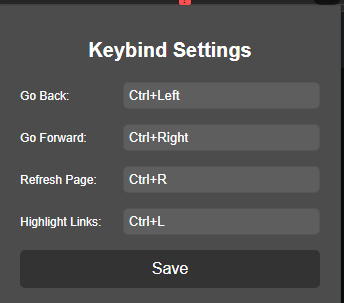

# My Keybind Extension

My Keybind Extension allows you to navigate web pages using custom keybinds. You can set your own shortcuts for going back, going forward, refreshing the page, and highlighting all links on a page.

## Features

- **Go Back**: Navigate to the previous page.
- **Go Forward**: Navigate to the next page.
- **Refresh Page**: Reload the current page.
- **Highlight Links**: Highlight all links on the current page.
- **Custom Shortcuts**: Set and save your own keyboard shortcuts.

## Installation

1. Clone or download this repository.
2. Open Chrome and go to `chrome://extensions/`.
3. Enable "Developer mode" in the top right corner.
4. Click "Load unpacked" and select the directory where you downloaded or cloned this repository.

## Usage

1. Click on the extension icon in the Chrome toolbar to open the popup.
2. Set your desired keybinds in the input fields.
3. Click "Save" to store your keybinds.
4. Use the shortcuts to navigate web pages and highlight links.

## File Overview

- `manifest.json`: Defines the extension's metadata and permissions.
- `background.js`: Handles the keybind commands and actions.
- `content.js`: Contains the script to highlight links.
- `popup.html`: The HTML structure for the popup UI.
- `popup.js`: JavaScript for managing the popup UI interactions.
- `styles.css`: Styles for the popup UI.

## Screenshots

## Development

If you want to contribute to the development of this extension, follow these steps:

1. Fork the repository.
2. Create a new branch for your feature or bug fix.
3. Make your changes and commit them.
4. Push your changes to your fork.
5. Create a pull request to the main repository.

## License

This project is licensed under the MIT License. See the [LICENSE](LICENSE) file for details.

---

Feel free to modify this README as needed to better fit your project.
